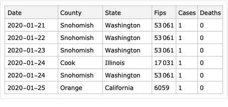
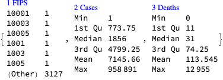
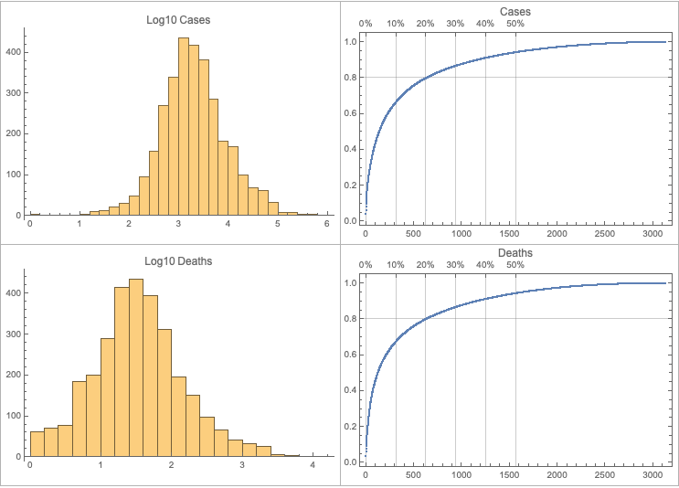
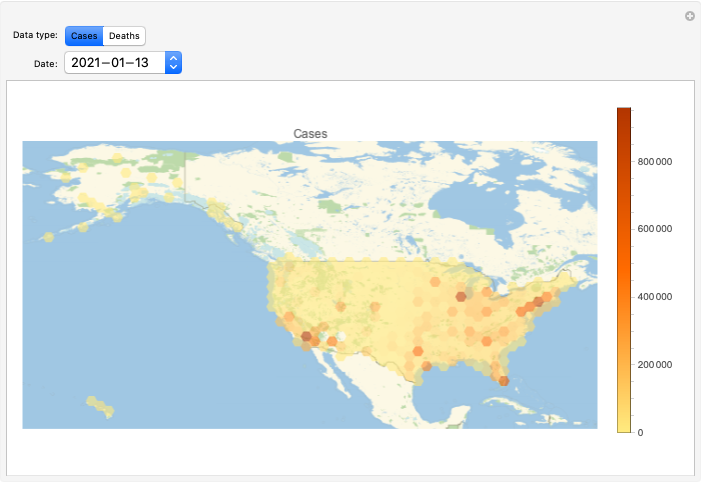
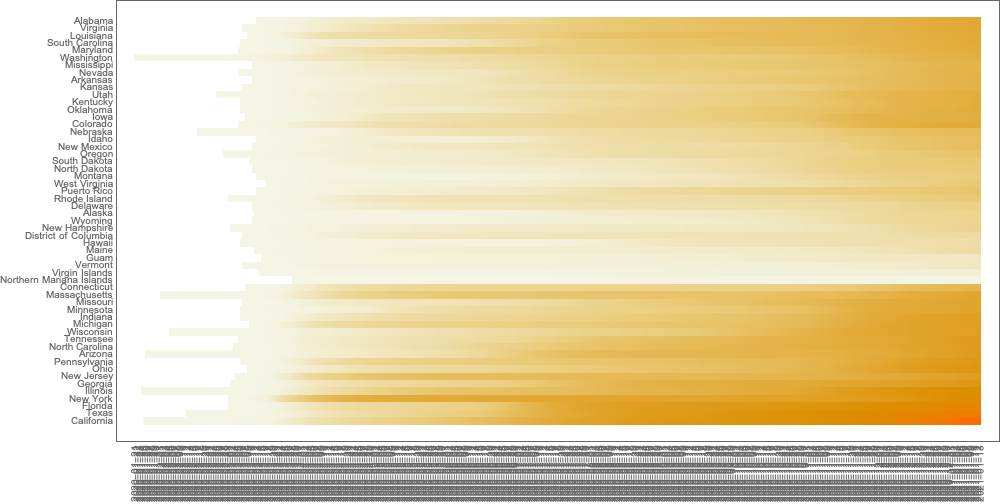

# NY Times COVID-19 data visualization

Anton Antonov   
[MathematicaForPrediction at WordPress](https://mathematicaforprediction.wordpress.com)   
[SystemModeling at GitHub](https://github.com/antononcube/SystemModeling)   
March 2020   
December 2020  
January 2021  

## Introduction

The purpose of this notebook is to give data locations, data ingestion code, 
and code for rudimentary analysis and visualization of COVID-19 data provided by New York Times, [NYT1]. 

The following steps are taken:

- Ingest data

    - Take COVID-19 data from The New York Times, based on reports from state and local health agencies, [NYT1].

    - Take USA counties records data (FIPS codes, geo-coordinates, populations), [WRI1].

- Merge the data.

- Make data summaries and related plots.

- Make corresponding geo-plots.

- Do “out of the box” time series forecast.

- Analyze fluctuations around time series trends.

Note that other, older repositories with COVID-19 data exist, like, [JH1, VK1].

**Remark:** The time series section is done for illustration purposes only. The forecasts there should not be taken seriously.

## Import data

### NYTimes USA states data

```mathematica
dsNYDataStates = ResourceFunction["ImportCSVToDataset"]["https://raw.githubusercontent.com/nytimes/covid-19-data/master/us-states.csv"];
dsNYDataStates = dsNYDataStates[All, AssociationThread[Capitalize /@ Keys[#], Values[#]] &];
dsNYDataStates[[1 ;; 6]]

```


```mathematica
ResourceFunction["RecordsSummary"][dsNYDataStates]
```


### NYTimes USA counties data

```mathematica
dsNYDataCounties = ResourceFunction["ImportCSVToDataset"]["https://raw.githubusercontent.com/nytimes/covid-19-data/master/us-counties.csv"];
dsNYDataCounties = dsNYDataCounties[All, AssociationThread[Capitalize /@ Keys[#], Values[#]] &];
dsNYDataCounties[[1 ;; 6]]
```



```mathematica
ResourceFunction["RecordsSummary"][dsNYDataCounties]
```


### US county records

```mathematica
dsUSACountyData = ResourceFunction["ImportCSVToDataset"]["https://raw.githubusercontent.com/antononcube/SystemModeling/master/Data/dfUSACountyRecords.csv"];
dsUSACountyData = dsUSACountyData[All, Join[#, <|"FIPS" -> ToExpression[#FIPS]|>] &];
dsUSACountyData[[1 ;; 6]]
```


```mathematica
ResourceFunction["RecordsSummary"][dsUSACountyData]
```


## Merge data

Verify that the two datasets have common FIPS codes:

```mathematica
Length[Intersection[Normal[dsUSACountyData[All, "FIPS"]], Normal[dsNYDataCounties[All, "Fips"]]]]

(*3133*)
```

Merge the datasets:

```mathematica
dsNYDataCountiesExtended = Dataset[JoinAcross[Normal[dsNYDataCounties], Normal[dsUSACountyData[All, {"FIPS", "Lat", "Lon", "Population"}]], Key["Fips"] -> Key["FIPS"]]];
```

Add a “DateObject” column and (reverse) sort by date:

```mathematica
dsNYDataCountiesExtended = dsNYDataCountiesExtended[All, Join[<|"DateObject" -> DateObject[#Date]|>, #] &];
dsNYDataCountiesExtended = dsNYDataCountiesExtended[ReverseSortBy[#DateObject &]];
dsNYDataCountiesExtended[[1 ;; 6]]
```


## Basic data analysis

We consider cases and deaths for the last date only. (The queries can be easily adjusted for other dates.)

```mathematica
dfQuery = dsNYDataCountiesExtended[Select[#Date == dsNYDataCountiesExtended[1, "Date"] &], {"FIPS", "Cases", "Deaths"}];
dfQuery = dfQuery[All, Prepend[#, "FIPS" -> ToString[#FIPS]] &];
```

```mathematica
Total[dfQuery[All, {"Cases", "Deaths"}]]

(*<|"Cases" -> 22387340, "Deaths" -> 355736|>*)
```

Here is the summary of the values of cases and deaths across the different USA counties:

```mathematica
ResourceFunction["RecordsSummary"][dfQuery]
```



The following table of plots shows the distributions of cases and deaths and the corresponding 
[Pareto principle](https://en.wikipedia.org/wiki/Pareto_principle) adherence plots:

```mathematica
opts = {PlotRange -> All, ImageSize -> Medium};
Rasterize[Grid[
   Function[{columnName}, 
     {Histogram[Log10[#], PlotLabel -> Row[{Log10, Spacer[3], columnName}], opts], ResourceFunction["ParetoPrinciplePlot"][#, PlotLabel -> columnName, opts]} &@Normal[dfQuery[All, columnName]] 
    ] /@ {"Cases", "Deaths"}, 
   Dividers -> All, FrameStyle -> GrayLevel[0.7]]]
```



A couple of observations:

- The logarithms of the cases and deaths have nearly Normal or Logistic distributions.

- Typical manifestation of the Pareto principle: $80$% of the cases and deaths are registered in $20$% of the counties.

**Remark:** The top $20$% counties of the cases are not necessarily the same as the top $20$% counties of the deaths.

### Distributions

Here we find the distributions that correspond to the cases and deaths (using 
[`FindDistribution`](https://reference.wolfram.com/language/ref/FindDistribution.html)
):

```mathematica
ResourceFunction["GridTableForm"][List @@@ Map[Function[{columnName}, 
     columnName -> FindDistribution[N@Log10[Select[#, # > 0 &]]] &@Normal[dfQuery[All, columnName]] 
    ], {"Cases", "Deaths"}], TableHeadings -> {"Data", "Distribution"}]
```


### Pareto principle locations

The following query finds the intersection between that for the top $600$ Pareto principle locations for the cases and deaths:

```mathematica
Length[Intersection @@ Map[Function[{columnName}, Keys[TakeLargest[Normal@dfQuery[Association, #FIPS -> #[columnName] &], 600]]], {"Cases", "Deaths"}]]

(*516*)
```

## Geo-histogram

```mathematica
lsAllDates = Union[Normal[dsNYDataCountiesExtended[All, "Date"]]];
lsAllDates // Length

(*359*)
```

```mathematica
Manipulate[
  DynamicModule[{ds = dsNYDataCountiesExtended[Select[#Date == datePick &]]}, 
   GeoHistogram[
    Normal[ds[All, {"Lat", "Lon"}][All, Values]] -> N[Normal[ds[All, columnName]]], 
    Quantity[150, "Miles"], PlotLabel -> columnName, PlotLegends -> Automatic, ImageSize -> Large, GeoProjection -> "Equirectangular"] 
  ], 
  {{columnName, "Cases", "Data type:"}, {"Cases", "Deaths"}}, 
  {{datePick, Last[lsAllDates], "Date:"}, lsAllDates}]
```



## Heat-map plots

An alternative of the geo-visualization is to use a heat-map plot. Here we use the package 
["HeatmapPlot.m"](https://github.com/antononcube/MathematicaForPrediction/blob/master/Misc/HeatmapPlot.m), [AAp1].

```mathematica
Import["https://raw.githubusercontent.com/antononcube/MathematicaForPrediction/master/Misc/HeatmapPlot.m"]
```

### Cases

Cross-tabulate states with dates over cases:

```mathematica
matSDC = ResourceFunction["CrossTabulate"][dsNYDataStates[All, {"State", "Date", "Cases"}], "Sparse" -> True];
```

Make a heat-map plot by sorting the columns of the cross-tabulation matrix (that correspond to states):

```mathematica
HeatmapPlot[matSDC, DistanceFunction -> {EuclideanDistance, None}, AspectRatio -> 1/2, ImageSize -> 1000]
```



### Deaths

Cross-tabulate states with dates over deaths and plot:

```mathematica
matSDD = ResourceFunction["CrossTabulate"][dsNYDataStates[All, {"State", "Date", "Deaths"}], "Sparse" -> True];
HeatmapPlot[matSDD, DistanceFunction -> {EuclideanDistance, None}, AspectRatio -> 1/2, ImageSize -> 1000]
```


## Time series analysis

### Cases

#### Time series

For each date sum all cases over the states, make a time series, and plot it:

```mathematica
tsCases = TimeSeries@(List @@@ Normal[GroupBy[Normal[dsNYDataCountiesExtended], #DateObject &, Total[#Cases & /@ #] &]]);
opts = {PlotTheme -> "Detailed", PlotRange -> All, AspectRatio -> 1/4,ImageSize -> Large};
DateListPlot[tsCases, PlotLabel -> "Cases", opts]
```


```mathematica
ResourceFunction["RecordsSummary"][tsCases["Path"]]
```


Logarithmic plot:

```mathematica
DateListPlot[Log10[tsCases], PlotLabel -> Row[{Log10, Spacer[3], "Cases"}], opts]
```


#### “Forecast”

Fit a time series model to log 10 of the time series:

```mathematica
tsm = TimeSeriesModelFit[Log10[tsCases]]
```


Plot log 10 data and forecast:

```mathematica
DateListPlot[{tsm["TemporalData"], TimeSeriesForecast[tsm, {10}]}, opts, PlotLegends -> {"Data", "Forecast"}]
```


Plot data and forecast:

```mathematica
DateListPlot[{tsCases, 10^TimeSeriesForecast[tsm, {10}]}, opts, PlotLegends -> {"Data", "Forecast"}]
```


### Deaths

#### Time series

For each date sum all cases over the states, make a time series, and plot it:

```mathematica
tsDeaths = TimeSeries@(List @@@ Normal[GroupBy[Normal[dsNYDataCountiesExtended], #DateObject &, Total[#Deaths & /@ #] &]]);
opts = {PlotTheme -> "Detailed", PlotRange -> All, AspectRatio -> 1/4,ImageSize -> Large};
DateListPlot[tsDeaths, PlotLabel -> "Deaths", opts]
```


```mathematica
ResourceFunction["RecordsSummary"][tsDeaths["Path"]]
```


#### “Forecast”

Fit a time series model:

```mathematica
tsm = TimeSeriesModelFit[tsDeaths, "ARMA"]
```


Plot data and forecast:

```mathematica
DateListPlot[{tsm["TemporalData"], TimeSeriesForecast[tsm, {10}]}, opts, PlotLegends -> {"Data", "Forecast"}]
```


## Fluctuations

We want to see does the time series data have fluctuations around its trends and estimate the distributions of those fluctuations. 
(Knowing those distributions some further studies can be done.)

This can be efficiently using the software monad `QRMon`, 
[[AAp2](https://github.com/antononcube/MathematicaForPrediction/blob/master/MonadicProgramming/MonadicQuantileRegression.m), AA1]. 
Here we load the `QRMon` package:

```mathematica
Import["https://raw.githubusercontent.com/antononcube/MathematicaForPrediction/master/MonadicProgramming/MonadicQuantileRegression.m"]
```

### Fluctuations presence

Here we plot the consecutive differences of the cases:

```mathematica
DateListPlot[Differences[tsCases], ImageSize -> Large, AspectRatio -> 1/4, PlotRange -> All]
```


Here we plot the consecutive differences of the deaths:

```mathematica
DateListPlot[Differences[tsDeaths], ImageSize -> Large, AspectRatio -> 1/4, PlotRange -> All]
```


From the plots we see that time series are not monotonically increasing, and there are non-trivial fluctuations in the data.

### Absolute and relative errors distributions

Here we take interesting part of the cases data:

```mathematica
tsData = TimeSeriesWindow[tsCases, {{2020, 5, 1}, {2020, 12, 31}}];
```

Here we specify QRMon workflow that 
rescales the data, 
fits a B-spline curve to get the trend, 
and finds the absolute and relative errors (residuals, fluctuations) around that trend:

```mathematica
qrObj = 
   QRMonUnit[tsData]⟹
    QRMonEchoDataSummary⟹
    QRMonRescale[Axes -> {False, True}]⟹
    QRMonEchoDataSummary⟹
    QRMonQuantileRegression[16, 0.5]⟹
    QRMonSetRegressionFunctionsPlotOptions[{PlotStyle -> Red}]⟹
    QRMonDateListPlot[AspectRatio -> 1/4, ImageSize -> Large]⟹
    QRMonErrorPlots["RelativeErrors" -> False, AspectRatio -> 1/4, ImageSize -> Large, DateListPlot -> True]⟹
    QRMonErrorPlots["RelativeErrors" -> True, AspectRatio -> 1/4, ImageSize -> Large, DateListPlot -> True];
```


Here we find the distribution of the absolute errors (fluctuations) using 
[`FindDistribution`](https://reference.wolfram.com/language/ref/FindDistribution.html):

```mathematica
lsNoise = (qrObj⟹QRMonErrors["RelativeErrors" -> False]⟹QRMonTakeValue)[0.5];
FindDistribution[lsNoise[[All, 2]]]

(*CauchyDistribution[6.0799*10^-6, 0.000331709]*)
```

Absolute errors distributions for the last $90$ days:

```mathematica
lsNoise = (qrObj⟹QRMonErrors["RelativeErrors" -> False]⟹QRMonTakeValue)[0.5];
FindDistribution[lsNoise[[-90 ;; -1, 2]]]

(*ExtremeValueDistribution[-0.000996315, 0.00207593]*)
```

Here we find the distribution of the of the relative errors:

```mathematica
lsNoise = (qrObj⟹QRMonErrors["RelativeErrors" -> True]⟹QRMonTakeValue)[0.5];
FindDistribution[lsNoise[[All, 2]]]

(*StudentTDistribution[0.0000511326, 0.00244023, 1.59364]*)
```

Relative errors distributions for the last $90$ days:

```mathematica
lsNoise = (qrObj⟹QRMonErrors["RelativeErrors" -> True]⟹QRMonTakeValue)[0.5];
FindDistribution[lsNoise[[-90 ;; -1, 2]]]

(*NormalDistribution[9.66949*10^-6, 0.00394395]*)
```

## References

[NYT1] The New York Times, [Coronavirus (Covid-19) Data in the United States](https://github.com/nytimes/covid-19-data), (2020), GitHub.

[WRI1] Wolfram Research Inc., [USA county records](https://github.com/antononcube/SystemModeling/blob/master/Data/dfUSACountyRecords.csv), (2020), [System Modeling at GitHub](https://github.com/antononcube/SystemModeling).

[JH1] CSSE at Johns Hopkins University, [COVID-19](https://github.com/CSSEGISandData/COVID-19), (2020), GitHub.

[VK1] Vitaliy Kaurov, [Resources For Novel Coronavirus COVID-19](https://community.wolfram.com/groups/-/m/t/1872608), (2020), [community.wolfram.com](https://community.wolfram.com).

[AA1] Anton Antonov, ["A monad for Quantile Regression workflows"](https://mathematicaforprediction.wordpress.com/2018/08/01/a-monad-for-quantile-regression-workflows/), (2018), at [MathematicaForPrediction WordPress](https://mathematicaforprediction.wordpress.com).

[AAp1] Anton Antonov, [Heatmap plot Mathematica package](https://github.com/antononcube/MathematicaForPrediction/blob/master/Misc/HeatmapPlot.m), (2018), [MathematicaForPrediciton at GitHub](https://github.com/antononcube/MathematicaForPrediction).

[AAp2] Anton Antonov, [Monadic Quantile Regression Mathematica package](https://github.com/antononcube/MathematicaForPrediction/blob/master/MonadicProgramming/MonadicQuantileRegression.m), (2018), [MathematicaForPrediciton at GitHub](https://github.com/antononcube/MathematicaForPrediction).
