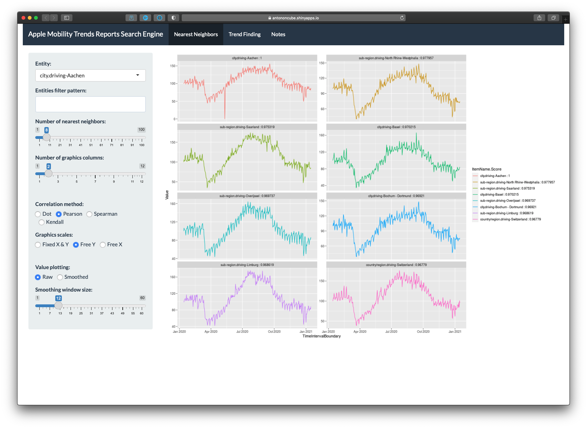
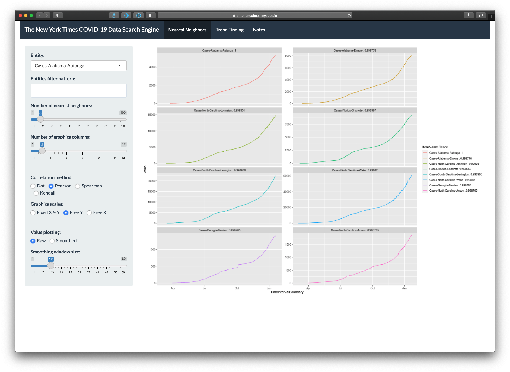
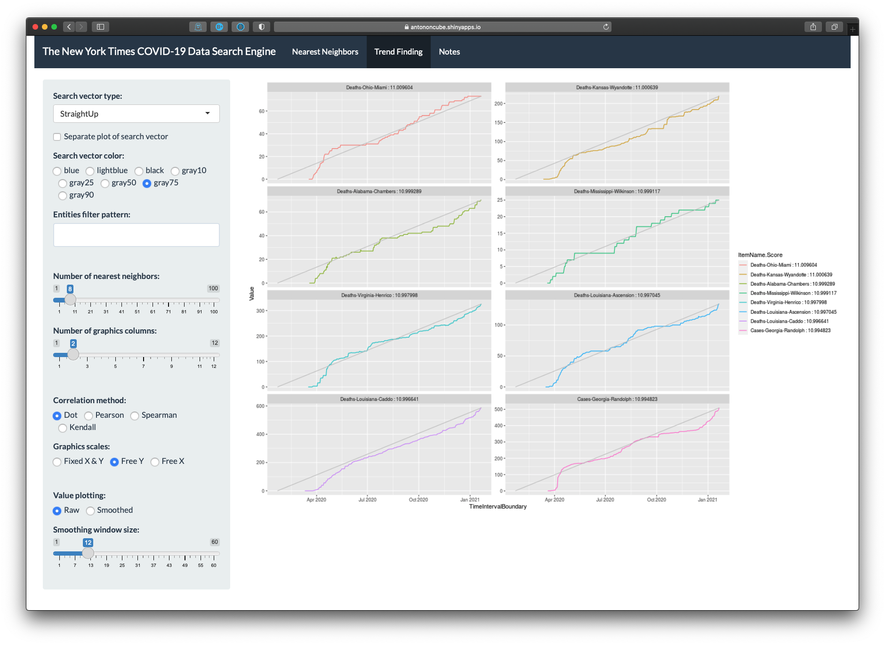
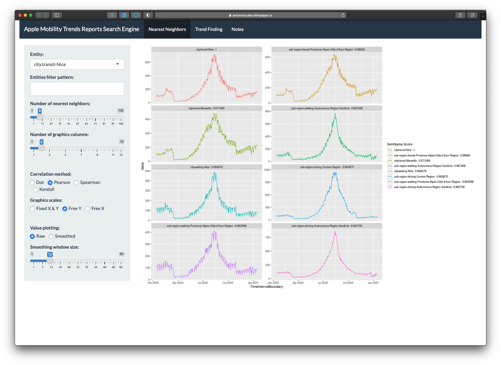
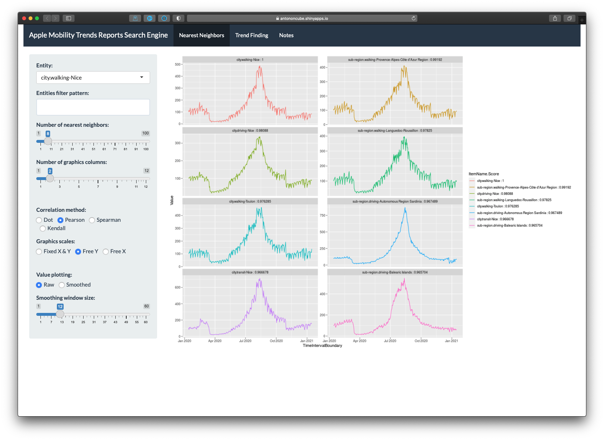
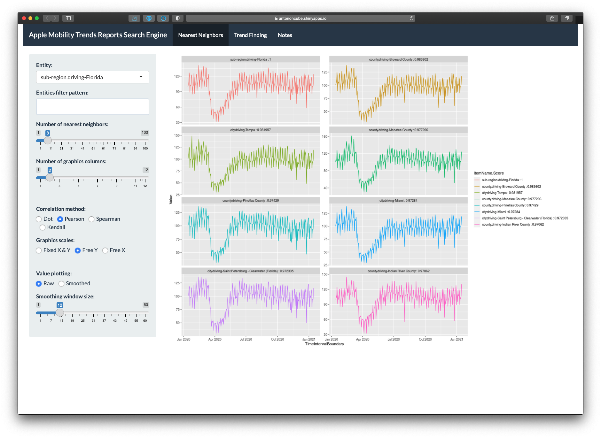
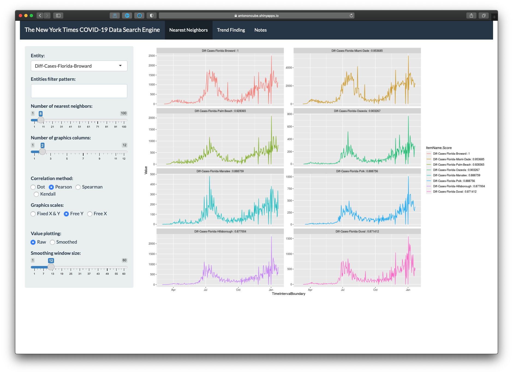
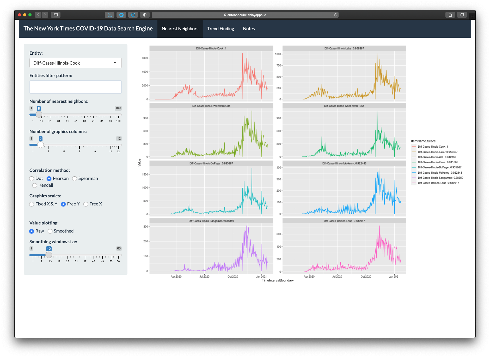

# Time series search engines over COVID-19 data

## Introduction 

In this article we proclaim the preparation and availability of interactive interfaces to
two Time Series Search Engines (TSSEs) over COVID-19 data. 
One TSSE is based on Apple Mobility Trends data, [APPL1]; 
the other on The New York Times COVID-19 data, [NYT1].

Here are links to interactive interfaces of the TSSEs hosted at 
[shinyapps.io by RStudio](https://www.shinyapps.io):

- [Apple Mobility Trends Reports Search Engine](https://antononcube.shinyapps.io/AppleCOVID19MobilityTrends/)

- [The New York Times COVID-19 Data Search Engine](https://antononcube.shinyapps.io/NYTimesCOVID19DataInUSA/)

**Motivation:** The primary motivation for making the TSSEs and their interactive interfaces 
is to use them as exploratory tools.
Combined with relevant data analysis (e.g. [AA1, AA2]) the TSSEs should help to form better intuition and feel
of the spread, data aggregation, and reactions to COVID-19. 

Below we briefly describe the overall process and the data. 
Then we give some search examples and their interpretations.

## The overall process

For both search engines the overall process has the same steps:

1. Ingest the data

2. Do basic (and advanced) data analysis

3. Make (and publish) reports detailing the data ingestion and transformation steps

4. Enhances the data with transformed versions of it or with additional related data

5. Make a Time Series Sparse Matrix Recommender (TSSMR)

6. Make a Time Series Search Engine Interactive Interface (TSSEII)

7. Make the interactive interface easily accessible over the World Wide Web

Here is a flow chart that corresponds to the steps listed above:

## Data

### The Apple data

The Apple Mobility Trends data is taken from Apple's site, see [APPL1].
The data ingestion and basic data analysis, time series seasonality demonstration, (graph) clusterings 
are given in [AA1].

The weather data was taken using the 
[Mathematica](https://www.wolfram.com/mathematica/)
function
[`WeatherData`](https://reference.wolfram.com/language/ref/WeatherData.html), 
[WRI1].

(It was too much work to get the weather data with some of the well known weather data R packages.)

## The search engines

The following sub-sections have screenshots of the TSSE interactive interfaces.

I did experiment with combining the data of the two engines, but did not turn out to be particularly useful.
It is seems that is more interesting and useful to enhance the Apple data engine with temperature data, 
and to enhance The New Your Times engine with the (consecutive) differences of the time series. 

### Structure

The interactive interfaces have three panels:

- Nearest Neighbors    
  - With entity selection and filtering  

- Trend Finding   
  - With predefined trend curves and entity filtering
    
- Notes 
  - For references and data objects summary

### [Apple Mobility Trends Reports Search Engine](https://antononcube.shinyapps.io/AppleCOVID19MobilityTrends/)

The Apple data TSSE has four types of time series ("entities"). The first three are normalized volumes 
of Apple maps requests while, driving, transit transport use, and walking. (See [AA1] for more details.)
  
The fourth is mean temperature at different geo-locations.

Here are screenshots of the panels "Nearest Neighbors" and "Trend Finding" (at interface launch):

<!--

-->

### [The New York Times COVID-19 Data Search Engine](https://antononcube.shinyapps.io/NYTimesCOVID19DataInUSA/)

The New York Times TSSE has four types of time series (aggregated) cases and deaths, 
and their corresponding time series differences. 

Here are screenshots of the panels "Nearest Neighbors" and "Trend Finding" (at interface launch):

<!--

-->

### The New York Times data

The New York Times COVID-19 data is taken from GitHub, see [NYT1].
The data ingestion and basic data analysis and visualizations are given in [AA1].

## Apple data search examples

Consider the results of the Nearest Neighbors panel for Nice, France.

Since French tend to go on vacation in July and August ([SS1, INSEE1]) 
we can see that driving, transit, and walking in Nice have pronounced peaks during that time:

Of course, we also observe the lockdown period in that geographical area.

Compare those time series with the time series from driving in Florida, USA:

We can see that people in Florida, USA more or less the same driving patterns unrelated to 
the typical weather seasons and vacation periods.

## The New York Times data search examples

In Broward county, Florida, USA and and Cook county, Illinois, USA we can see two waves of infections
in the difference time series:

## References

### Data

[APPL1] Apple Inc., 
[Mobility Trends Reports](https://www.apple.com/covid19/mobility), 
(2020), 
[apple.com](https://www.apple.com).

[NYT1] The New York Times, 
[Coronavirus (Covid-19) Data in the United States](https://github.com/nytimes/covid-19-data), 
(2020), 
GitHub.

[WRI1]
Wolfram Research (2008), 
[WeatherData](https://reference.wolfram.com/language/ref/WeatherData.html), 
Wolfram Language function.

### Articles

[AA1] Anton Antonov, 
["Apple mobility trends data visualization (for COVID-19)"](https://github.com/antononcube/SystemModeling/blob/master/Projects/Coronavirus-propagation-dynamics/Documents/Apple-mobility-trends-data-visualization.md),
(2020), 
[SystemModeling at GitHub](https://github.com/antononcube/SystemModeling).

[AA2] Anton Antonov, 
["NY Times COVID-19 data visualization"](https://github.com/antononcube/SystemModeling/blob/master/Projects/Coronavirus-propagation-dynamics/Documents/NYTimes-COVID-19-data-visualization.md), 
(2020), 
[SystemModeling at GitHub](https://github.com/antononcube/SystemModeling).

[INSEE1] Institut national de la statistique et des études économiques, 
["En 2010, les salariés ont pris en moyenne six semaines de congé"](https://www.insee.fr/fr/statistiques/1281344),
(2012).

[SS1] Sam Schechner and Lee Harris,
["What Happens When All of France Takes Vacation? 438 Miles of Traffic"](https://www.wsj.com/articles/what-happens-when-all-of-france-takes-vacation-438-miles-of-traffic-11564600399),
(2019),
[The Wall Street Journal](https://www.wsj.com/)