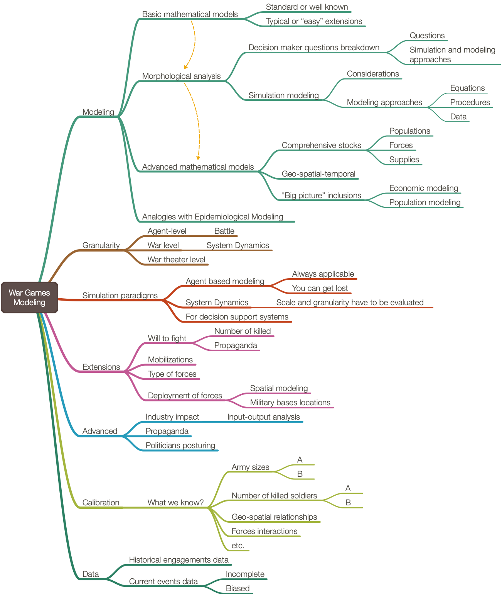
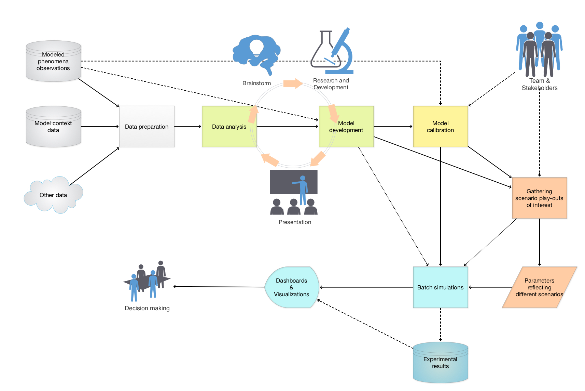

# War Games Dynamics

This project has models for different aspects of War Games Dynamics (WGD).

The aim is to produce comprehensive modeling support of war games simulations that:

1. Allow faithful approximations of real life military exercises or wars
2. Conducting experiments for different "what-if" scenarios

We intend to (mostly) use 
[System Dynamics (SD)](https://en.wikipedia.org/wiki/System_dynamics)
for the models in this project.

**Remark:** The modeling know-how and software framework developed for the 
["Coronavirus propagation dynamics"](https://github.com/antononcube/SystemModeling/tree/master/Projects/Coronavirus-propagation-dynamics) 
simulations can be applied and utilized for SD models for WGD. 

-------

## Modeling scope

The following mind-map illustrates the scope of the modeling work:

This diagram shows the "big picture" in which the considered comprehensive models 
should be a major part of:

--------

## Simple war game models

The simplest war games models are derived in the works of Mikhail Pavlovich Osipov and
[Frederick William Lanchester](https://en.wikipedia.org/wiki/Frederick_W._Lanchester), [Wk1, Wk2, LG1].

We see the
[Lanchester's laws](https://en.wikipedia.org/wiki/Lanchester%27s_laws), [Wk2],
as the simplest models and together with their "easy" model extensions for "will to fight" and "supplies."  

This Wolfram Language (WL) notebook discusses symbolic and numerical solutions of the corresponding
systems of differential equations.

-------

## Historical notes

Osipov derived Lanchester's laws and fitted them to existing data of wars in 1915, [LG1]:

> Osipov’s most unique and important contribution is the explicit and systematic 
> application to quantitative historical data of what, for his time, 
> were fairly advanced formal statistical methods.

Lanchester published his work in 1916.

------

## References

[LG1] Lester W. Grau and Clint Reach,
["A Mathematical Probability of Success for Soviets in Cold War Confrontation"](https://www.ikn.army.mil/apps/MIPBW/MIPB_Features/AMathematicalProbabilityofSuccessforSovietsinCOldWarConfrontation.pdf)
(2021),
Military Intelligence.

[NBM1] Н. В. МИТЮКОВ,
["М. П. ОСИПОВ: К ИДЕНТИФИКАЦИИ ЛИЧНОСТИ АВТОРА ПЕРВОЙ МОДЕЛИ ГЛОБАЛЬНЫХ ПРОЦЕССОВ"](https://www.socionauki.ru/journal/files/ipisi/2011_2/mitukov.pdf)
(2011),
Историческая психология и социология истории.

[Wk1] Wikipedia entry,
[Frederick W. Lanchester](https://en.wikipedia.org/wiki/Frederick_W._Lanchester).

[Wk2] Wikipedia entry,
[Lanchester's laws](https://en.wikipedia.org/wiki/Lanchester%27s_laws).
